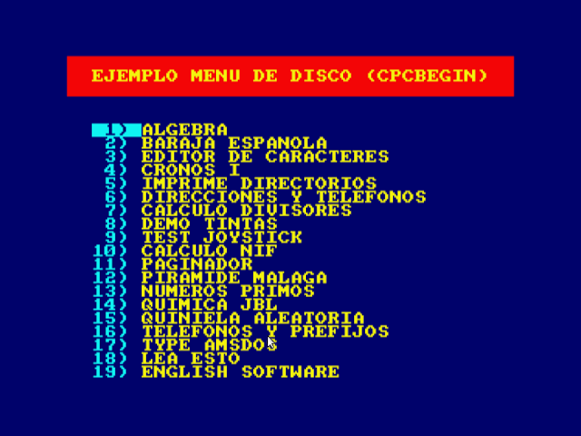
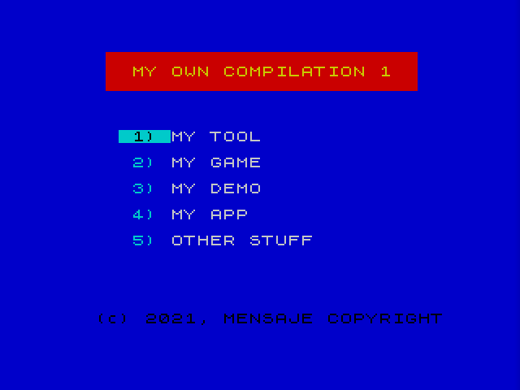

# 8 bit Disk Menu File

## Amstrad CPC

DISC.BAS file to add to your Amstrad CPC compilations.

## ZX Spectrum +3

DISK file to add to your ZX Spectrum +3 compilations.

Support autoboot from menu, you must save with the command:
``SAVE"DISK" LINE 0``

## How to use
1. Download the correct file to add to your DSK file: cpc/disc.bas or zxspectrum/disk.
2. Alter final lines with your own DATA.
3. Copy the file to a real disc to use in real hardware or inject into a DSK image file with DATA format to use in an emulator.

Notice: this software may be buggy, if you detect a bug comment in issues section.